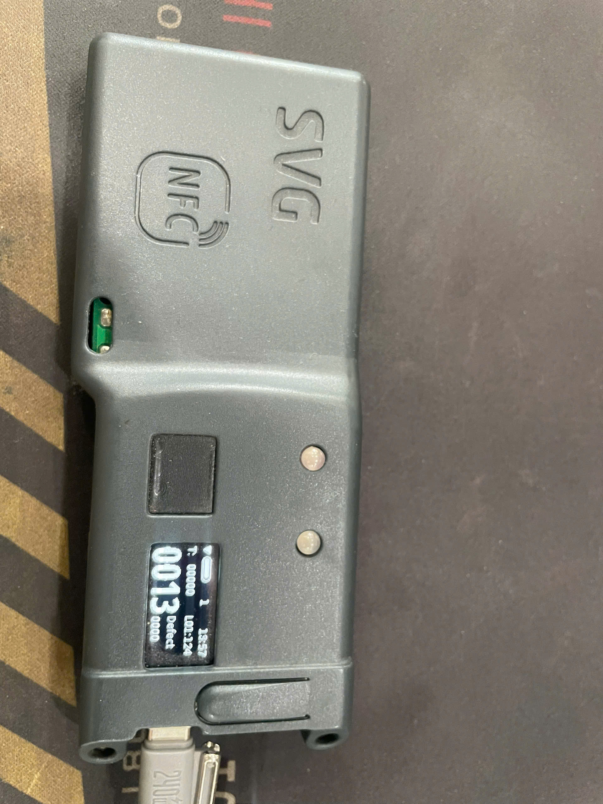

# ESP IoT Monitoring System  
Industrial Production Monitoring Device using ESP8266

---

## 📌 Overview

This project is an **industrial IoT production monitoring system** successfully deployed in a garment manufacturing factory.

The device collects production data directly from sewing machines, identifies operators via NFC, displays real-time production information, and synchronizes data with the factory **DGS/MES server** through MQTT communication.

Designed for stable **24/7 factory operation**.

---

## 🏭 Real Deployment

✅ Successfully deployed in industrial sewing workshops  
✅ Continuous production monitoring  
✅ Real-time operator identification  
✅ Integrated with factory MES/DGS system  

---

## 🧰 Hardware Specification

- ESP8266 WiFi Microcontroller
- 0.96 inch OLED Display
- NFC Reader mrc522 (User Identification & Data Storage)
- Industrial machine pulse input
- Status indicator LEDs
- USB Power Supply

---

## ⚙️ System Features

### Production Monitoring
- Real-time production counting
- Machine pulse signal detection
- Defect tracking support
- Local data buffering

### NFC User Management
- Operator login via NFC card
- Read / write user information
- Production tracking by operator ID

### Connectivity
- WiFi connection with auto-reconnect
- MQTT communication with server
- Real-time data synchronization

### Firmware Management
- HTTPS OTA firmware update
- Remote firmware deployment
- Secure update mechanism

### Reliability Design
- Non-blocking firmware architecture
- Watchdog recovery
- Network failure handling
- Designed for long-term industrial usage

---

### 🌐 System Architecture

```text
      Sewing Machine
      │
      ▼
      Production Pulse
      │
      ▼
      ESP8266 Device
      ├── NFC User Login
      ├── OLED Display
      └── Production Counter
      │
      ▼
      WiFi Network
      │
      ▼
      MQTT Broker
      │
      ▼
      DGS / MES Server
```
---

## 📡 Communication Protocol

**Protocol:** MQTT  
**Transport:** TCP/IP over WiFi  

Example payload:

```json
{
  "device_id": "SVG-001",
  "operator_id": "NFC_1024",
  "production_count": 1350,
  "defect_count": 12,
  "timestamp": "2026-03-02T10:30:00"
}
```

---
## 🚀 OTA Update
Firmware updates are delivered remotely using:
- HTTPS secure download
- Version control validation
- Automatic reboot after update
- No physical access required during deployment.

---
## 📂 Project Structure

```bash
ESP-IoT-Monitoring-System/
│
├── src/            # Application source code
├── include/        # Header definitions
├── lib/            # Drivers & custom modules
├── doc/            # System documents
├── platformio.ini
└── README.md
```
---

## 🖥️ Development Environment

- PlatformIO
- Arduino Framework
- C/C++
- MQTT Protocol
- REST / HTTPS OTA
- FreeRTOS-based task handling

---
## 📊 Industrial Use Cases

- Garment factory production monitoring
- Operator performance tracking
- ANDON system integration
- MES/DGS data collection
- Smart factory IoT deployment

---
## 📷 Device Overview

